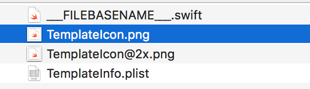
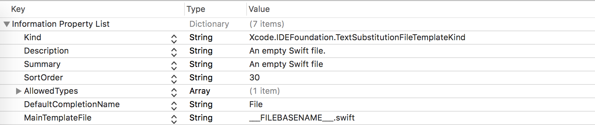
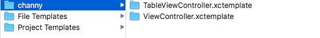
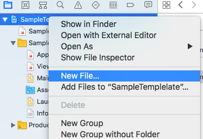
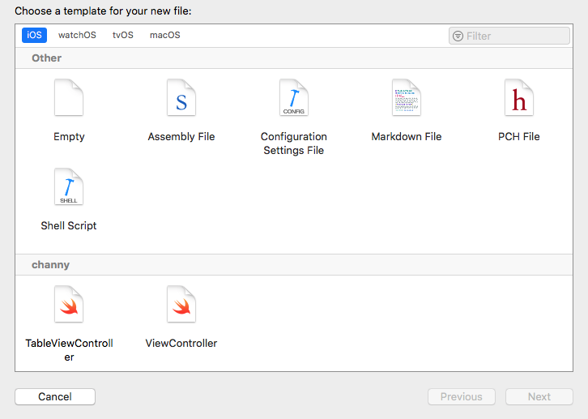

# Template 만들기

`xcode` 에서 기본적으로 제공하는 것이 아닌 자신이 직접 만든 Template을 사용할 수 있는 방법은 없을까? 생각을 해봤을 것입니다.  Template 만드는 방법과 적용 방법을 공유 하겠습니다

<br/>

## Template 만드는 방법

Template을 만들기 위해서는 총 3가지 종류의 파일이 필요하게 됩니다.

```
1. __FILEBASENAME__.swift 
2. TemplateIcon.png, TemplateIcon@2x.png
3. TemplateInfo.plist
```

<br/>



<br/>

### ___FILEBASENAME___.swift

Template 으로 표현할 swift 파일을 의미하며 ___FILEBASENAME___ 파일명 형태를 유지하며 저장하여야 합니다. 사용자가 Template 으로 생성한 파일 이름이 ___FILEBASENAME___ 부분에 적용됩니다.

**UIViewController Template Example**

```swift
//___FILEHEADER___

import UIKit

class ___FILEBASENAMEASIDENTIFIER___: UIViewController {
  //-----------------------------------------------------------------
  // MARK: - IBOutlets
  //-----------------------------------------------------------------
  
  //-----------------------------------------------------------------
  // MARK: - Local Variables
  //-----------------------------------------------------------------
  
  //-----------------------------------------------------------------
  // MARK: - override method
  //-----------------------------------------------------------------
  override func viewDidLoad() {
    super.viewDidLoad()
  }
  
  override func viewWillAppear(_ animated: Bool) {
    super.viewWillAppear(animated)
  }
  
  override func viewDidAppear(_ animated: Bool) {
    super.viewDidAppear(animated)
  }
  
  override func viewWillDisappear(_ animated: Bool) {
    super.viewWillDisappear(animated)
  }
  
  override func viewDidDisappear(_ animated: Bool) {
    super.viewDidDisappear(animated)
  }
  
  override func didReceiveMemoryWarning() {
    super.didReceiveMemoryWarning()
  }
  
  //-------------------------------------------------------------------------------------------
  // MARK: - IBOutlets
  //-------------------------------------------------------------------------------------------
  
  //-------------------------------------------------------------------------------------------
  // MARK: - Local method
  //-------------------------------------------------------------------------------------------
}
```

이런 식으로 구성했을 때 ViewController을 만들면서 작성해야하는 중복되는 코드들에 대한 생성 속도를 최소화 할 수 있습니다.

<br/>

### TemplateIcon.png

Template 선택 화면에서 보여지는 이미지 입니다. 자유롭게 변경 할 수 있습니다.

<br/>

### TemplateInfo.plist

`xcode`에서 Template 을 적용하려면 plist의 데이터 값이 정확히 입력되어야 합니다. 



<br/>

## Template 적용 하기

`Template`  을 만드셨다면 `xcode` 에 넣어줘야합니다.

```
/Applications/Xcode.app/Contents/Developer/Library/Xcode/Templates/Project
```

위 주소로 만들어준 Template 파일을 하나의 폴더에 넣어서 옮겨줍니다. Template 을 갖고 있는 폴더명은 파일명 끝에 '.xctemplate'로 지정해야하며 폴더명이 `xcode` 의 템플릿명이 됩니다.



위의 그림을 보면 channy가 템플릿 그룹명이 되며 TableViewcontroller와 viewController 두 개의 탬플릿이 추가한 것을 확인 할 수 있습니다.

<br/>

## Template  사용하기

`xcode`  실행 한 후  프로젝트 실행(또는 생성) 하여 `New File` 진입합니다.



New File 작업창의 가장 하단으로 내리면 추가한 Template 파일을 확인할 수 있습니다. 원하는 템플릿을 선택 후 생성하면 기존 작성한 탬플릿 형태로 생성됩니다.



<br/>

## 정리

Template을 생성하여 공통된 코딩 스타일을 설정하는 방법을 공유하였습니다. 다양한 자신만의 템플릿을 오픈소스로 공유하여 다양한 의견을 받아 안정성있고 다양한 템플릿으로 발전하는 것도 좋을 거 같습니다. 
